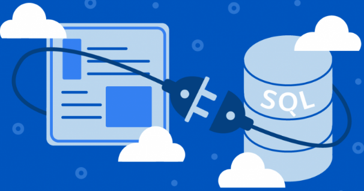

# Database Systems (CS305) Lab 6 Assignment

A Complete Database Management System driven by Python.

**Assigned** : Thursday 26 October 2023

**Due** : Thursday 2 November 2023



Figure 1: SQL experts who are able to work directly with an SQL databases are rare, but the databases that they produce are found in many common applications and areas. Users are still able to work with such database systems despite the SQL learning curve thanks to programmed management systems software that convert user commands into SQL commands. Such systems manage the database I/O, in addition to data maintenance and other database operations.

In this lab, you will create a complete database management system (DBMS) to interact with the database that we will create from supplied data. Our DBMS will facilitate users to run *CRUD* functions on SQL databases; *CREATE, READ, UPDATE* and *DELETE*. For this lab, you will have to create a menu-driven system that will facilitate a user’s interaction with a local SQL database.

Please note, it is very likely that you will need to complete your own research in order to write code in Python to complete these tasks.

## Project Goals

* To build a database from scratch from a given a set of data
* To gain experience using Python to manage database code
* To gain experience in completing your own research to complete programming tasks
* To create a fully functional database management system to facilitate and implement common CRUD functionalities in SQLite databases.

## Introduction

Database Management Systems (DBMS) are software applications that provide a structured and organized way to store, manage, and retrieve data. They act as intermediaries between users and the underlying database, allowing users to interact with data without needing to write complex database code. DBMSes serve as a crucial bridge, simplifying the process of working with databases for (non-coding) users who may not have a deep understanding of database internals.

DBMSes abstract the underlying complexities of data storage and retrieval, shielding users from the need to write low-level code. This abstraction enables users to interact with data using high-level and user-friendly interfaces, such as SQL queries or graphical user interfaces, which are much more user-friendly and intuitive. This accessibility allows individuals from various domains, not just software developers or database administrators, to efficiently work with data without having to be an expert in SQL programming to use the DB. DBMSes also ensure data integrity, security, and concurrent access control, reducing the risk of data corruption or unauthorized access.

Another important part of more advanced DBMSes is that they offer features and programming to handle data backup and recovery, data indexing, and query optimization, further improving data management efficiency for non-technical users. Database Management Systems serve to simplify data handling, enhance data security, and to facilitate database users

From given data, in this lab, you will be building a simple database management system from the schema-up and then applying this system to your Python code to drive it.

## The Database

## The Rick and Morty Data


The data for this project concerns the Rick and Morty cartoon series, and was available from Kaggle at [https://www.kaggle.com/datasets/igorbettio/rick-and-morty-data] (https://www.kaggle.com/datasets/igorbettio/rick-and-morty-data) at the time of this lab write-up. The data is provided for you in the `src/data/`. There are three files in the data; `characters.csv`, `episodes.csv`, and `locations.csv`.

### The Build File

Using on the data, your task is to design and implement this database system from scratch. You will have to create all three tables (there are `cvs` files provided as the data) and use primary and foreign keys where appropriate.

To create the tables, you will have to determine the names of the attributes from the data files.

We note that the primary keys of each table are to be used to ensure that there is no redundancy in the database, and the foreign keys are to be used to ensure that certain relationships are made before particular tables may be populated, as described above.

Please place all database building code in the file `src/build_DB.txt`.

## The Database Manager (Python)

You will implement a manager system in Python for the local database that you previously created with a build file, and the given data. Your DBMS must engage with this database and allow users to interact with the data.

*Think Intuitively*: Please spend time to consider how best to help the database user to utilize your menu system to find information. One handy function that you would want to build in to the menu would be a `.table` and `.schema` command (or similar) to show what kinds of data there is available for interaction.

*Menu system*: Your DBMS must be driven by a simple menu system to allow any user to choose a particular database option to implement (i.e., querying, adding data, editing data or removing data). Each selected option will then evoke specific functions in the Python code to perform the necessary commands against the database.

Your code will connect the database, pass it commands to execute, receive (fetch) the results from the database and provide basic formatting to facilitate tidy output for the user.

During your programming, it is very likely that you will have to complete some of your own research into Python programming in order to complete some of the tasks involved with this project.

---

## Deliverables

Summary of the Required Deliverables
Please submit your work by pushing it to your GitHub Classroom repository.

1. **Reflection document**: You will modify the file `writing/reflection.md` to respond questions in the document.

2. **Database-building file**: You will submit your edited build file (`src/DB_build.txt`) to be used to build your database from your obtained data files.

3. **Python code**: Your will submit your working code in the file `src/myDBMS.py` which will provide a menu-driven system to allow users to interact with the database created earlier using the build file.


### Screenshots

If you would like to add screenshots to your work, please use the the following Markdown code;

```

```

The following html code serves to scale-down your graphic.

```

```

If you are using VSCode, then you can visualize your completed Markdown file to determine whether your files are present and are displaying in your document.

## Technical Information

### Git

Practicing software developers normally use a version control system to manage most of the artifacts produced during the phases of the software development life cycle.

In this course, we will always use the `git` distributed version control system to manage the files associated with our course. In particular, we will use this secure resource to submit our all our assignments and projects.

To help you get started with installing course software, our course [resources page](https://www.oliverbonhamcarter.com/resources/), contains URL links to download sites and important tutorials.

Note, if you are using a Mac or Linux machine, you may already have this software installed; try typing `git` at your terminal to check. On a MacOS machine, this command will ask you whether you wish to install `xCode`. Please follow the steps to install.

 If you are using a Windows machine then it is likely that you will need to install the software. Ask a Technical Leader or your instructor for help as necessary.

### Create your account on GitHub

It is assumed that you already have an account on GitHub but if you do not, then please visit [github.com](http://www.github.com) to create your account using your Allegheny email address. Follow the account generation links to create an account on GitHub using a normal name (to identify you) and be sure to add a current photo of yourself when completing your profile.

### Add Your SSH Keys to your account

SSH keys allow you to interact with GitHub using secure means. Using these keys, you can conveniently push and pull data from GitHub without having to input your user name and password each time. When developing code, it will be desirable to make frequent pushes to GitHub with your code so that any problems or bugs, can be isolated with the development of specific parts of code.

To learn more about creating and adding your ssh keys to your GitHub account. Please visit https://www.ssh.com/ssh/keygen/ to learn how to set-up your security keys. Let the instructor know if you have any questions with this task. For more information about ssh keys, please watch Professor Luman’s SSH Key [video](https://www.youtube.com/watch?v=qEPjUGQFmzQ&list=PLsYZRXov75ZHSwWiCk0-jd1RcTuu_-zmD).

### Submitting Assignments

As you are working on your lab, you are to commit and push regularly. The commands are the following.

```
git add -A
git commit -m ‘‘Your notes about commit here’’ 
git push
```

## Project Assessment

The grade that a student receives on this assignment will have the following components.

* **GitHub Actions CI Build Status [up to 15%]:**: For the lab repository associated with this assignment students will receive a checkmark grade if their last before-the-deadline build passes. This is only checking some baseline writing and commit requirements as well as correct running of the program. An additional reduction will given if the commit log shows a cluster of commits at the end clearly used just to pass this requirement. An addition reduction will also be given if there is no commit during lab work times. All other requirements are evaluated manually.

* **Mastery of Technical Writing [up to 25%]:**: Students will also receive a checkmark grade when the responses to the writing questions presented in the deliverable Files of the directory `writing/` that reveal a proficiency of both writing skills and technical knowledge. To receive a checkmark grade, the submitted writing should have correct spelling, grammar, and punctuation in addition to following the rules of Markdown and providing conceptually and technically accurate answers.

* **Mastery of Technical Knowledge and Skills [up to 60%]**: Students will receive a portion of their assignment grade when their program implementation reveals that they have mastered all of the technical knowledge and skills developed during the completion of this assignment. As a part of this grade, the instructor will assess aspects of the programming including, but not limited to, the completeness and the correctness of the program and the use of effective source code comments.

## GatorGrade

### Checks for GatorGrade

For immediate feedback on submissions, we will be using Gator Grade to inform the of missing components in the submission. As you submit, you will notice that there is a thick red X that will change to a green check mark when all components have been included in the submission. You are encouraged to click on the red X to find a listing of the components to address.

You can check the baseline writing and commit requirements for this lab assignment by running department's assignment checking `gatorgrade` tool. To use `gatorgrade`, you first need to make sure you have Python3 installed (type `python --version` to check). If you do not have Python installed, please see:

- [Setting Up Python on Windows](https://realpython.com/lessons/python-windows-setup/)
- [Python 3 Installation and Setup Guide](https://realpython.com/installing-python/)
- [How to Install Python 3 and Set Up a Local Programming Environment on Windows 10](https://www.digitalocean.com/community/tutorials/how-to-install-python-3-and-set-up-a-local-programming-environment-on-windows-10)

Then, if you have not done so already, you need to install `gatorgrade`:

- First, [install `pipx`](https://pypa.github.io/pipx/installation/)
- Then, install `gatorgrade` with `pipx install gatorgrade`

Finally, you can run `gatorgrade`:

`gatorgrade --config config/gatorgrade.yml`

## Seeking Assistance

* Extra resources for using markdown include;
  + [Markdown Tidbits](https://www.youtube.com/watch?v=cdJEUAy5IyA)
  + [Markdown Cheatsheet](https://github.com/adam-p/markdown-here/wiki/Markdown-Cheatsheet)
* Do not forget to use the above git commands to push your work to the cloud for the instructor to grade your assignment. You can go to your GitHub repository using your browser to verify that your files have been submitted. Please see the TL’s or the instructor if you have any questions about assignment submission.

Students who have questions about this project outside of the lab time are invited to ask them in the course's Discord channel or during instructor's or TL's office hours.
